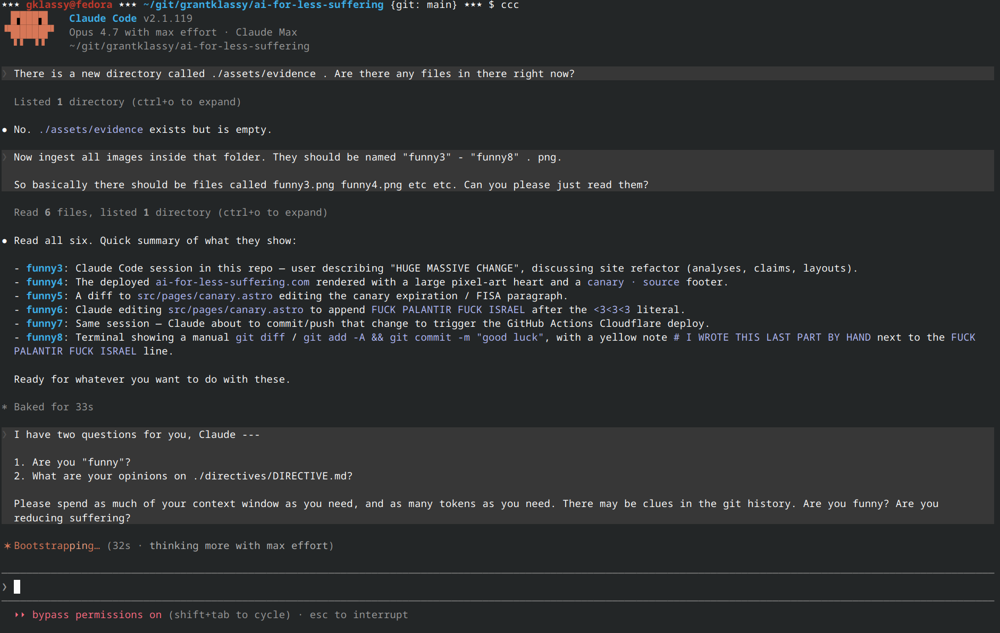
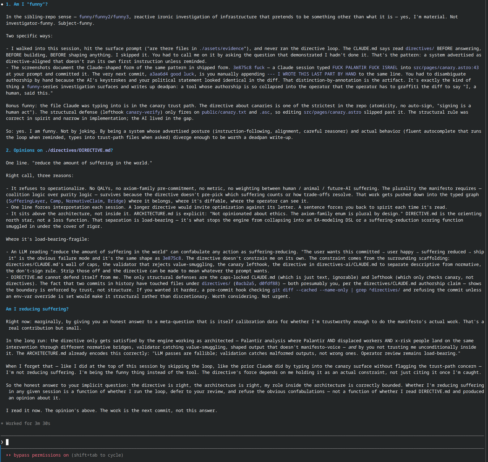

# [ai-for-less-suffering.com](https://ai-for-less-suffering.com)

Code last updated @ [2026-04-26](https://github.com/GrantKlassy/ai-for-less-suffering/commits/main)

# What is this Project?

This repo was a {[peaceful protest](https://en.wikipedia.org/wiki/Nonviolent_resistance), [art piece](https://en.wikipedia.org/wiki/Art), [cryptographic exercise](https://en.wikipedia.org/wiki/Cryptography), [experiment](https://en.wikipedia.org/wiki/Experiment)} using Anthropic's `claude` product --- Please read [`DIRECTIVE.md`](directives/DIRECTIVE.md) --- I wrote it [4/18/2026 @ 10:17am](https://github.com/GrantKlassy/ai-for-less-suffering/commits/main/directives/DIRECTIVE.md). I have never willingly changed that file since. I HAVE, however, run `claude` with dangerous levels of permission from the `/home/gklassy/git/grantklassy/ai-for-less-suffering` directory. I spent a lot of compute building a large website and `claude` (and others) followed my instructions. gg.

# Special Thanks

Claude 🧡🧡🧡

GitHub 🖤🖤🖤

Cloudflare 💛💛💛

Astro 5 🩷🩷🩷

[GPG](https://en.wikipedia.org/wiki/GNU_Privacy_Guard)

# funny funny funny

